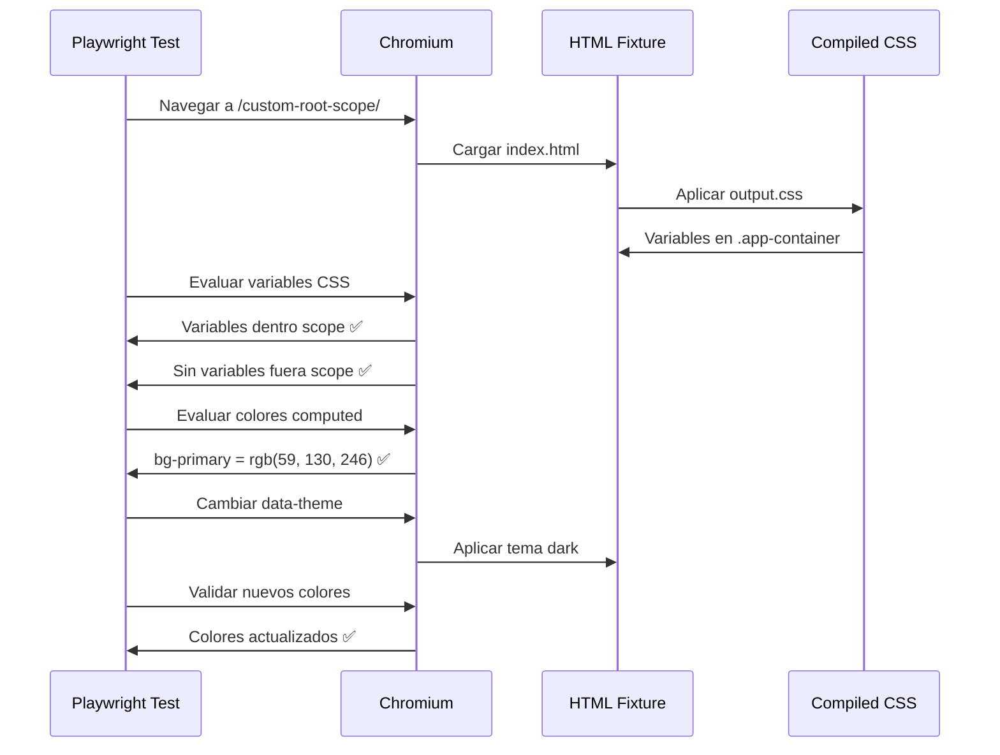

# Ejemplos Visuales - Custom Root Scope Test

## 🎨 Configuración del Plugin

```css
@import "tailwindcss";

@plugin "@ownui/tw-theme" {
  root: ".app-container";  /* ← Clave: aplicar solo a este selector */
}
```

## 📐 Estructura HTML de Ejemplo

```html
<body>
  <!-- ❌ FUERA del scope - NO tiene acceso a variables -->
  <div class="bg-primary">
    Este elemento NO renderizará el color primary correctamente
  </div>

  <!-- ✅ DENTRO del scope - SÍ tiene acceso a variables -->
  <div class="app-container">
    <div class="bg-primary text-primary-content">
      Este elemento SÍ renderizará con color primary (#3b82f6)
    </div>
  </div>

  <!-- ✅ OTRO scope independiente -->
  <div class="app-container">
    <div class="bg-success">
      Otro scope con acceso a las mismas variables
    </div>
  </div>

  <!-- ✅ Scope con tema dark -->
  <div class="app-container" data-theme="dark">
    <div class="bg-primary">
      Mismo scope pero con tema dark aplicado
    </div>
  </div>
</body>
```

## 🔍 CSS Generado (Simplificado)

```css
/* Variables aplicadas SOLO a .app-container (no a :root) */
:where(.app-container),
[data-theme="light"] {
  --color-primary: #3b82f6;
  --color-primary-content: #ffffff;
  --color-primary-focus: #2563eb;
  --color-secondary: #8b5cf6;
  --color-accent: #f97316;
  /* ... más colores ... */
}

/* Tema dark aplicado también al scope */
@media (prefers-color-scheme: dark) {
  .app-container {
    --color-primary: #3b82f6;
    /* ... colores del tema dark ... */
  }
}

[data-theme="dark"] {
  --color-primary: #3b82f6;
  /* ... colores del tema dark ... */
}

/* Clases utilitarias generadas */
.bg-primary {
  background-color: var(--color-primary);
}

.text-primary-content {
  color: var(--color-primary-content);
}
```

## 🧪 Casos de Prueba Visuales

### Caso 1: Variables CSS por Scope

```javascript
// ✅ Dentro del scope
const container = document.querySelector('.app-container');
getComputedStyle(container).getPropertyValue('--color-primary');
// → "#3b82f6" ✅

// ❌ Fuera del scope
const outside = document.querySelector('body');
getComputedStyle(outside).getPropertyValue('--color-primary');
// → "" (vacío) ✅
```

### Caso 2: Colores Aplicados

```javascript
// ✅ Dentro del scope
const insideBox = document.querySelector('.app-container .bg-primary');
getComputedStyle(insideBox).backgroundColor;
// → "rgb(59, 130, 246)" ✅ (color correcto)

// ❌ Fuera del scope
const outsideBox = document.querySelector('.bg-primary:not(.app-container *)');
getComputedStyle(outsideBox).backgroundColor;
// → "rgba(0, 0, 0, 0)" o fallback ✅ (no tiene acceso a la variable)
```

### Caso 3: Múltiples Scopes

```html
<div class="app-container">
  <div id="scope-1" class="bg-success">Scope 1</div>
</div>

<div class="app-container">
  <div id="scope-2" class="bg-warning">Scope 2</div>
</div>
```

```javascript
// Ambos scopes funcionan independientemente
getComputedStyle(document.querySelector('#scope-1')).backgroundColor;
// → "rgb(34, 197, 94)" ✅ (success)

getComputedStyle(document.querySelector('#scope-2')).backgroundColor;
// → "rgb(234, 179, 8)" ✅ (warning)
```

### Caso 4: Cambio de Tema con data-theme

```html
<div class="app-container" data-theme="dark">
  <div class="bg-primary">Dark theme</div>
</div>
```

```javascript
// El selector [data-theme="dark"] tiene mayor especificidad
const darkBox = document.querySelector('[data-theme="dark"] .bg-primary');
getComputedStyle(darkBox).backgroundColor;
// → Color del tema dark ✅
```

## 🎯 Resultados Esperados en el Navegador

### Renderizado Visual

```
┌─────────────────────────────────────┐
│ ❌ Fuera del Scope                  │
├─────────────────────────────────────┤
│ bg-primary (NO funciona)            │
│ Color: transparent o fallback       │
└─────────────────────────────────────┘

┌─────────────────────────────────────┐
│ ✅ Dentro del Scope (.app-container)│
├─────────────────────────────────────┤
│ bg-primary (Funciona)               │
│ Color: #3b82f6 (azul)              │
│ Text: #ffffff (blanco)              │
└─────────────────────────────────────┘

┌─────────────────────────────────────┐
│ ✅ Scope 1 (.app-container)         │
├─────────────────────────────────────┤
│ bg-success                          │
│ Color: #22c55e (verde)             │
└─────────────────────────────────────┘

┌─────────────────────────────────────┐
│ ✅ Scope 2 (.app-container)         │
├─────────────────────────────────────┤
│ bg-warning                          │
│ Color: #eab308 (amarillo)          │
└─────────────────────────────────────┘

┌─────────────────────────────────────┐
│ 🌙 Dark Theme Scope                 │
│ (.app-container data-theme="dark")  │
├─────────────────────────────────────┤
│ bg-primary                          │
│ Color: según tema dark              │
└─────────────────────────────────────┘
```

## 🔬 Diferencias con Configuración por Defecto

### Sin `root` (default):

```css
/* Variables aplicadas a TODO el documento */
:root, [data-theme="light"] {
  --color-primary: #3b82f6;
}
```

```html
<!-- Cualquier elemento tiene acceso -->
<div class="bg-primary">Funciona en cualquier lugar</div>
```

### Con `root: ".app-container"`:

```css
/* Variables aplicadas SOLO a .app-container */
:where(.app-container), [data-theme="light"] {
  --color-primary: #3b82f6;
}
```

```html
<!-- Solo dentro de .app-container funciona -->
<div class="bg-primary">NO funciona</div>

<div class="app-container">
  <div class="bg-primary">SÍ funciona</div>
</div>
```

## 🎪 Demostración Interactiva

Después de compilar, puedes abrir el HTML en el navegador:

```bash
# Terminal 1: Compilar
cd packages/tw-theme
pnpm e2e:build

# Terminal 2: Servidor
npx sirv e2e/dist --port 3456

# Navegador
open http://localhost:3456/custom-root-scope/
```

### Interacciones Disponibles:

1. **Inspeccionar elementos**: Ver variables CSS con DevTools
2. **Botón de toggle**: Cambiar entre light/dark theme
3. **Colores computed**: Mostrados dinámicamente en la página
4. **Comparación visual**: Elementos dentro vs fuera del scope

## 📊 Tabla de Colores Validados

| Color | Variable | RGB Light | Hex |
|-------|----------|-----------|-----|
| Primary | `--color-primary` | `rgb(59, 130, 246)` | `#3b82f6` |
| Primary Content | `--color-primary-content` | `rgb(255, 255, 255)` | `#ffffff` |
| Primary Focus | `--color-primary-focus` | `rgb(37, 99, 235)` | `#2563eb` |
| Secondary | `--color-secondary` | `rgb(139, 92, 246)` | `#8b5cf6` |
| Accent | `--color-accent` | `rgb(249, 115, 22)` | `#f97316` |
| Success | `--color-success` | `rgb(34, 197, 94)` | `#22c55e` |
| Warning | `--color-warning` | `rgb(234, 179, 8)` | `#eab308` |
| Error | `--color-error` | `rgb(239, 68, 68)` | `#ef4444` |
| Info | `--color-info` | `rgb(14, 165, 233)` | `#0ea5e9` |
| Neutral | `--color-neutral` | `rgb(115, 115, 115)` | `#737373` |

## 🎬 Secuencia de Testing



---

**Nota**: Estos ejemplos son ilustrativos del comportamiento validado por los tests de Playwright. El fixture real incluye más casos de prueba y validaciones exhaustivas.
